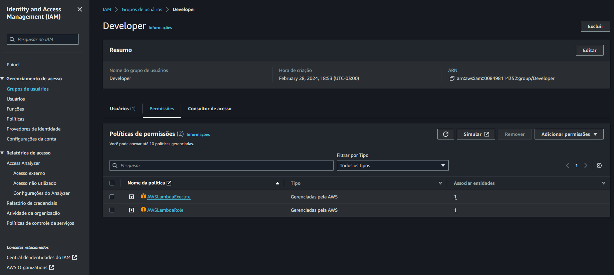

# CRIANDO GRUPOS

    --> Cada grupo de usuários tem sua/suas políticas, proporcionando uma maior organização 
        ao trabalho do administrador da cloud e facilitando a divisão de
        atribuições e permissões de cada usuário na cloud.

    --> Podemos criar grupos para os profissionais de infraestrutura de redes e 
        para os profissionais de desenvolvimento, onde escolhemos que os
        primeiros tenham acesso aos serviço EC2 e S3 com as políticas
        AmazonEC2FullAccess e AmazonS3FullAccess, e os desenvolvedores
        tenham acesso ao serviço Lambda com as políticas AWSLambdaExecute e 
        AWSLambdaRole, POR EXEMPLO.


1. As **Policies(Políticas)** são escritas na linguagem ***JSON***, "por baixo dos panos na AWS".
    - EXEMPLO 1: *AdministratorAccess*
                Provides full access to AWS services and resources.
    ```
    {
    "Version": "2012-10-17",
    "Statement": [
        {
            "Effect": "Allow",
            "Action": "*",
            "Resource": "*"
            }
        ]
    }
    ```
    - EXEMPLO 2: *AmazonS3FullAccess*
                  Provides full access to all buckets via the AWS Management Console.
    ```
    {
    "Version": "2012-10-17",
    "Statement": [
        {
            "Effect": "Allow",
            "Action": [
                "s3:*",
                "s3-object-lambda:*"
            ],
            "Resource": "*"
            }
        ]
    }
    ```
    - EXEMPLO 3: *AmazonEC2FullAccess*
                Provides full access to Amazon EC2 via the AWS Management Console.
    ```
    {
    "Version": "2012-10-17",
    "Statement": [
        {
            "Action": "ec2:*",
            "Effect": "Allow",
            "Resource": "*"
        },
        {
            "Effect": "Allow",
            "Action": "elasticloadbalancing:*",
            "Resource": "*"
        },
        {
            "Effect": "Allow",
            "Action": "cloudwatch:*",
            "Resource": "*"
        },
        {
            "Effect": "Allow",
            "Action": "autoscaling:*",
            "Resource": "*"
        },
        {
            "Effect": "Allow",
            "Action": "iam:CreateServiceLinkedRole",
            "Resource": "*",
            "Condition": {
                "StringEquals": {
                    "iam:AWSServiceName": [
                        "autoscaling.amazonaws.com",
                        "ec2scheduled.amazonaws.com",
                        "elasticloadbalancing.amazonaws.com",
                        "spot.amazonaws.com",
                        "spotfleet.amazonaws.com",
                        "transitgateway.amazonaws.com"
                        ]
                    }
                }
            }
        ]
    }
    ```
