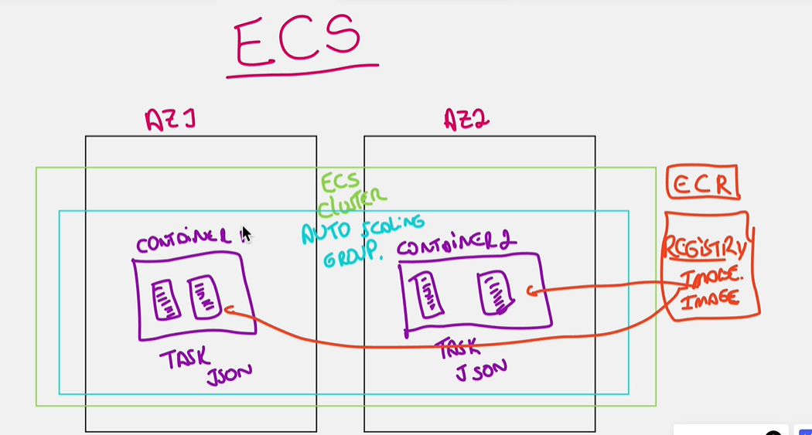

# Amazon Elastic Container Registry (ECR)

# Amazon Elastic Container Service (ECS)

    --> O Amazon Elastic Container Service (ECS) é um serviço de gerenciamento de contêineres altamente escalável e de alto desempenho que suporta contêineres Docker e permite que você execute e gerencie facilmente aplicações em contêiner na Amazon Web Services (AWS).

### Aqui estão algumas das principais características e funcionalidades do Amazon ECS:

 - Integração com a AWS: O ECS se integra perfeitamente com outros serviços da AWS, como o Amazon RDS, o Amazon DynamoDB, o AWS Lambda, o Amazon API Gateway, entre outros, facilitando a criação de aplicações com arquiteturas complexas.

 - Gerenciamento de Contêineres: O Amazon ECS gerencia o ciclo de vida dos contêineres, incluindo provisionamento, implantação, monitoramento de saúde, escala e desprovisionamento.

 - Escalabilidade: Com o Amazon ECS, você pode dimensionar suas aplicações de forma rápida e fácil para lidar com demandas de trabalho variáveis.

 - Segurança: As tarefas do ECS podem usar as funções do IAM para obter um controle de acesso fino aos recursos da AWS. Além disso, você pode executar suas tarefas em uma Amazon Virtual Private Cloud (VPC) para isolar suas aplicações.

 - Serviço Gerenciado: Como um serviço gerenciado, o Amazon ECS elimina a necessidade de instalar, operar e dimensionar a própria infraestrutura de gerenciamento de contêineres.

 - Monitoramento e Logs: O ECS oferece integração nativa com o Amazon CloudWatch e o Amazon CloudTrail, permitindo que você visualize métricas de utilização de recursos, acompanhe as chamadas de API e obtenha informações detalhadas sobre a saúde de suas aplicações.

 - Orquestração de Contêineres: O Amazon ECS permite a orquestração de contêineres complexos através de serviços e tarefas. Você pode especificar o número de contêineres para cada tarefa e definir regras para como eles devem ser posicionados em um cluster.

Em resumo, o Amazon ECS é uma ferramenta poderosa e escalável para a execução de aplicações em contêineres, oferecendo integração com a AWS e a flexibilidade de usar vários modelos de programação.