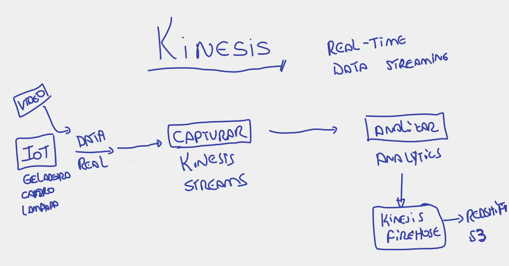

# AWS Kinesis

 - Criado para o que a AWS chama de REAL-TIME-DATA-STREAMING.

    --> Muito utilizado na **internet das coisas (IOT)**. Exemplo: 
    - Temos uma casa inteligente, onde estão uma geladeira, lâmpadas etc.
    - esses dispositivos inteligentes enviam dados a todo instante, que são capturados pelo ***Kinesis Streams***
    - os dados capturados pelo ***Kinesis Streams*** são enviados ao ***Kinesis Analytics*** para serem analisados por ele.
    - em seguida, os dados são enviados para o ***Kinesis Firehouse***, que pode enviar para um bucket no S3, Redshift etc.

