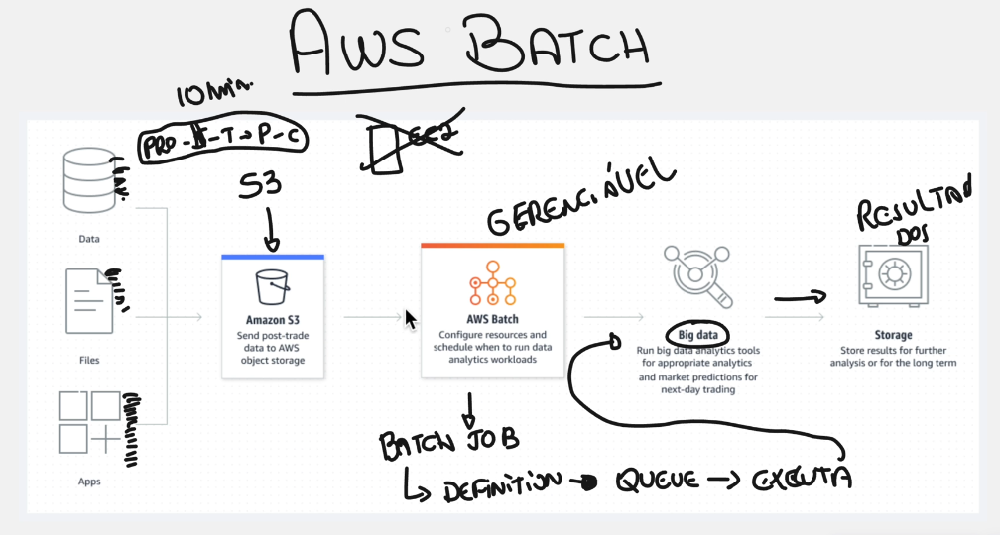

# AWS Batch

    --> Processamento em lote para treinamento, simulação e análise de modelos de ML(Machine Learning) em qualquer escala.

 - O que é o AWS Batch?
   - O AWS Batch ajuda a executar workloads de computação em lote na Nuvem AWS. A computação em lote é uma maneira comum para desenvolvedores, cientistas e engenheiros acessarem grandes quantidades de recursos de computação. O AWS Batch remove as tarefas gerais de configuração e gerenciamento da infraestrutura necessária, semelhante ao software de computação em lote tradicional. Esse serviço pode fornecer recursos com eficiência em resposta a trabalhos enviados para eliminar restrições de capacidade, reduzir os custos de computação e entregar resultados rapidamente. Como um serviço totalmente gerenciado, o AWS Batch ajuda a executar workloads de computação em lote de qualquer escala. O AWS Batch provisiona automaticamente recursos de computação e otimiza a distribuição da workload com base na quantidade e na escala das workloads. Com o AWS Batch, não há necessidade de instalar ou gerenciar o software de computação em lote, para que você possa concentrar seu tempo na análise de resultados e na resolução de problemas.

