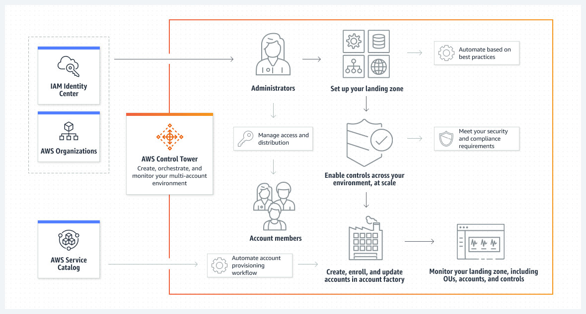

# AWS Control Tower

 - Utilizado em empresas que usam o serviço da AWS em grandíssima escala.
 - Simplifica o processo de criação de múltiplas contas AWS dentro de uma empresa.
 - Empresa com múltiplas contas na AWS.

## Como funciona?
 - Use o AWS Control Tower para configurar e operar um ambiente de várias contas da AWS com controles prescritivos projetados para acelerar a jornada para a nuvem.  O AWS Control Tower orquestra vários serviços da AWS em seu nome e administra as necessidades de segurança e conformidade, novas ou existentes, da organização.

