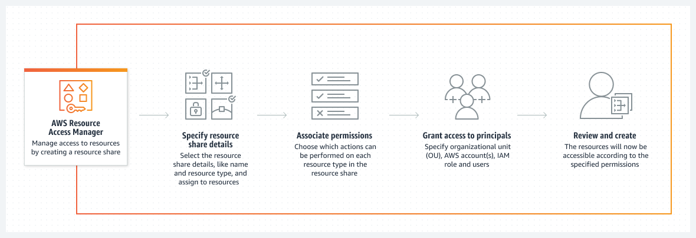
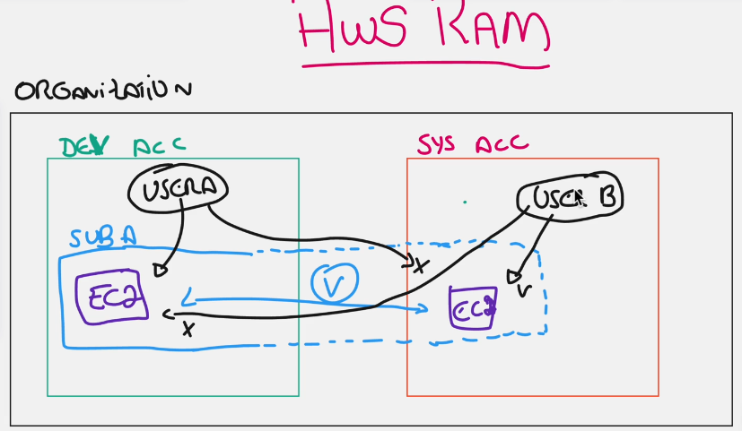

# AWS RAM (Resource Access Manager)

    --> Compartilhe seus recursos da AWS de maneira simples e segura em várias contas

## Como funciona?
 - O AWS RAM ajuda você a compartilhar seus recursos com segurança entre contas da AWS, dentro de sua organização ou unidades organizacionais (UOs) e com perfis e usuários do IAM para tipos de recursos compatíveis.

